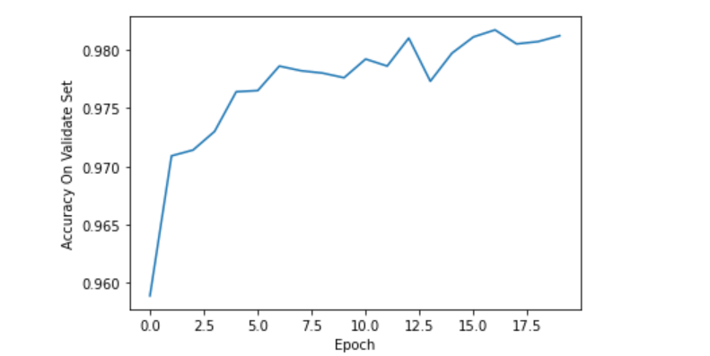

# 神经网络 - 实验文档

## 数据预处理

从网络上下载的原始数据不是能直接处理的格式，因此需要先转换成图片，具体的转换逻辑不是本实验的核心，因此不赘述，代码在 `convert.py` 中。

把原始的数据转换为图片之后分别保存在 `MNIST_data/train_images` 和 `MNIST_data/test_images`，文件名为 `[train/test]_[idx]_[label].jpg`。

为了后续使用方便，写一个 `CustomImageDataset` 类继承自 Pytorch 中的 `Dataset` 类，具体的实现见代码。

## 搭建卷积神经网络

定义一个类 `Net` 继承自 `torch.nn.Module`，定义网络架构，这里我使用的是叠了两层卷积 - Relu - 池化 块，后面再接两个全连接层。

```python
class Net(torch.nn.Module):
    def __init__(self):
        super(Net, self).__init__()
        self.conv1 = torch.nn.Sequential(
            torch.nn.Conv2d(1, 10, kernel_size=5),
            torch.nn.ReLU(),
            torch.nn.MaxPool2d(kernel_size=2),
        )
        self.conv2 = torch.nn.Sequential(
            torch.nn.Conv2d(10, 20, kernel_size=5),
            torch.nn.ReLU(),
            torch.nn.MaxPool2d(kernel_size=2),
        )
        self.fc = torch.nn.Sequential(
            torch.nn.Linear(320, 50),
            torch.nn.Linear(50, 10),
        )
     .....
```

## 模型训练和超参数选择

训练集大小是 60000，测试集 10000，为了进行超参数选择，将训练集以 5:1 划分，使用交叉熵损失函数， Adam 优化器进行训练，每个 epoch 做一次 validate，最终选择的超参数配置如下:

- learning_rate: 1e-3
- batch_size: 64
- n_epochs: 20



## 最终训练和测试

确定了超参数之后，把验证集的数据合并到训练集中，重新进行训练，最后在测试集上测试，得到的准确率为 `98.02%`


