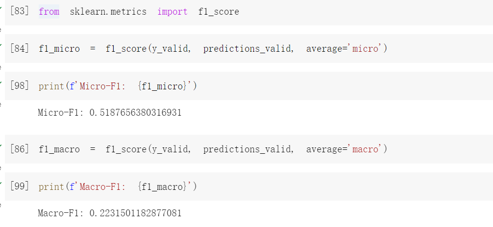

# 机器学习实验 - 决策树

## 概述

本实验报告将从顺序地介绍以下几个步骤中我的做法：

- 数据预处理
- 构建决策树划分标准函数
- 创建决策树
- 验证集评估
- 测试集预测

## 数据预处理

在非目标特征中有如下的特征：recordId，drugName，condition，reviewComment，date，usefulCount，sideEffects. 根据领域知识，我们知道真正影响评分的一般是 reviewComment (反映了使用者对这个药的情绪)，usefulCount 和 sideEffects (这个药的客观能力的评估)，因此我在数据预处理中只保留了这三列。

其中，usefulCount 是数值类型，表示起效的人数，不需要处理，reviewComment 和 sideEffects 都是文本类型，其中 reviewComments 是无任何规律的文本类型，而 sideEffects 则可以映射为数值类型。

我的具体处理方式如下：

- 对于 sideEffects，本来是 mild 到 severe，我映射成了 1 - 5 这几个数值，数值越大代表副作用越大。
- 对于 reviewComment，我用了先成的模型进行了情感分析，正面情绪的评论映射为 1，否则映射为 0.

经过上述步骤，数据已经转换成需要的格式。

## 构建决策树划分标准函数

决策树算法在构建决策树时，需要选择最佳的特征和划分点来划分数据。为了选择最佳的特征和划分点，决策树算法通常使用一种划分标准函数来衡量划分的质量。

常用的划分标准函数包括信息增益、信息增益比和基尼指数。

- 信息增益：信息增益表示划分前后数据集的不确定性减少的程度。信息增益越大，表示划分后数据集的不确定性越小，即划分的质量越高。信息增益通常用于 ID3 算法。
- 信息增益比：信息增益比是信息增益与特征熵的比值。信息增益比越大，表示划分的质量越高。信息增益比通常用于 C4.5 算法。
- 基尼指数：基尼指数表示划分后数据集的不纯度。基尼指数越小，表示划分后数据集的不纯度越小，即划分的质量越高。基尼指数通常用于 CART 算法。

这里我用的是基尼指数，因为实现起来比较简单。

## 创建决策树

CART 算法创建决策树的过程大致如下：

1. 选择最佳的特征和划分点来划分数据。CART 算法使用基尼指数作为划分标准函数，选择基尼指数最小的特征和划分点作为最佳的特征和划分点。
2. 根据最佳的特征和划分点，将数据划分为两个子集。
3. 对每个子集递归地重复步骤 1 和步骤 2，直到满足停止条件。停止条件可以是决策树的深度达到预设值，或者每个叶节点中的样本数量达到预设值。
4. 对决策树进行剪枝。剪枝是一种减少决策树复杂度的方法，它可以通过移除不重要的节点来简化决策树。CART 算法使用代价复杂度剪枝（Cost-Complexity Pruning）方法进行剪枝。

具体实现可以见代码中的 build_tree 函数。

## 验证集评估

用 2 中提到的方法处理验证集，得到评估结果如下图。

## 测试集预测

用 2 中预处理方法处理测试集，结果保存在 result.csv